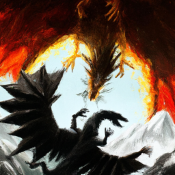

# AI RPG GAME

An AI based Image and text generative game changes by the game prompt. Using DALLE and GPT-3 API on Python.

[Youtube Video](https://www.youtube.com/watch?v=3uTxNwdB1r0)

Packages Needed
-
* [OpenAI](https://openai.com/)
* PySimpleGUI
* Cloudscraper
* PIL

How To Run ?
-
#### Open AI API key needed to run program! for API keys => [OpenAI](https://openai.com/)

you can use your or other custom prompts by selecting Custom Game section.

In the custom game section:
  * Lookup \GameStyles for example Image styles
  * Lookup \GameModes for example gamemode prompts
  
Have Fun!

Current Scenarios :
-
* Dragon vs Satan Spell Fight or Peace Negotiation
* Knight Attacking Back Dragons Castle

Current Visual Styles :
-
* Fearful Oil Painting
* Oil Painting
* Colorful Painting
* ametaur sketch
* lego

Some creations and scenarios :
-

